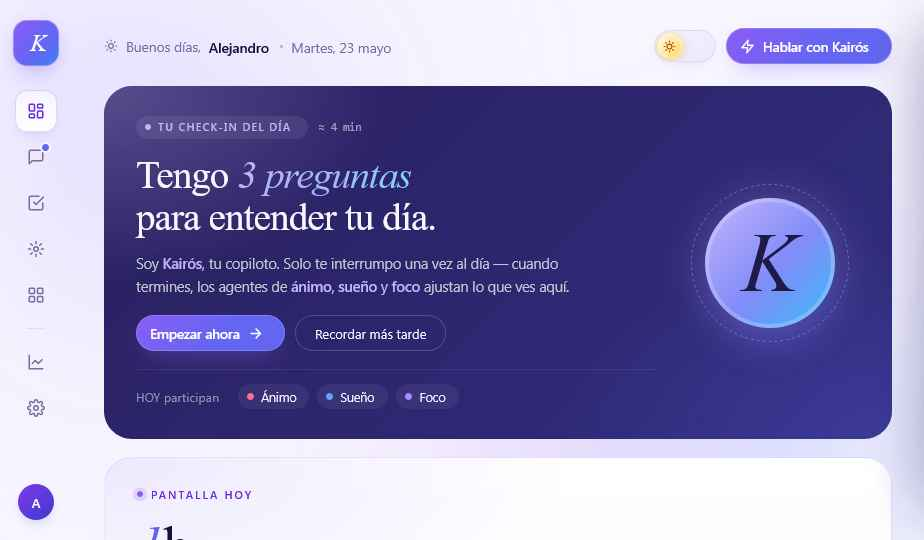
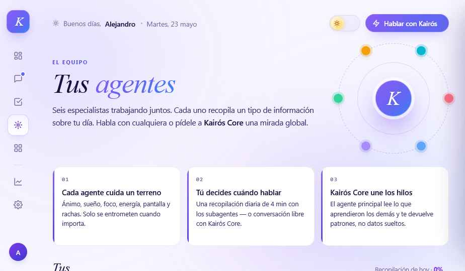

# Kairós — Dashboard

Dashboard estático del hackathon **Kairós**: copiloto diario con seis agentes (ánimo, sueño, foco, energía, pantalla y rachas) que recopilan información sobre tu día y la condensan en un check-in de 4 minutos.

## Stack

Sitio 100% estático — sin paso de build.

- `index.html` — UI completa con estilos embebidos
- `overlays.css` — overlays (chat, drawers, modales)
- `interactivity.js` — lógica de navegación, estado de agentes y router por hash
- `tweaks-panel.jsx` — panel de tweaks en tiempo real (React + Babel standalone vía CDN)

## Desarrollo

```bash
npm install
npm run dev
```

Abre <http://localhost:3000>.

Atajos:
- `Shift + R` — reset del estado en `sessionStorage`
- Hash routing: `#dashboard`, `#chat`, `#habitos`, `#agentes`, `#herramientas`, `#analytics`, `#ajustes`

## Deploy

```bash
vercel
```

Configurado vía `vercel.json` — Vercel lo sirve directamente como sitio estático.

## Estructura

```
.
├── index.html           # Vista principal (todas las pantallas en una sola página)
├── overlays.css
├── interactivity.js
├── tweaks-panel.jsx
└── assets/screenshots/  # Capturas de referencia del diseño
```

## Capturas



